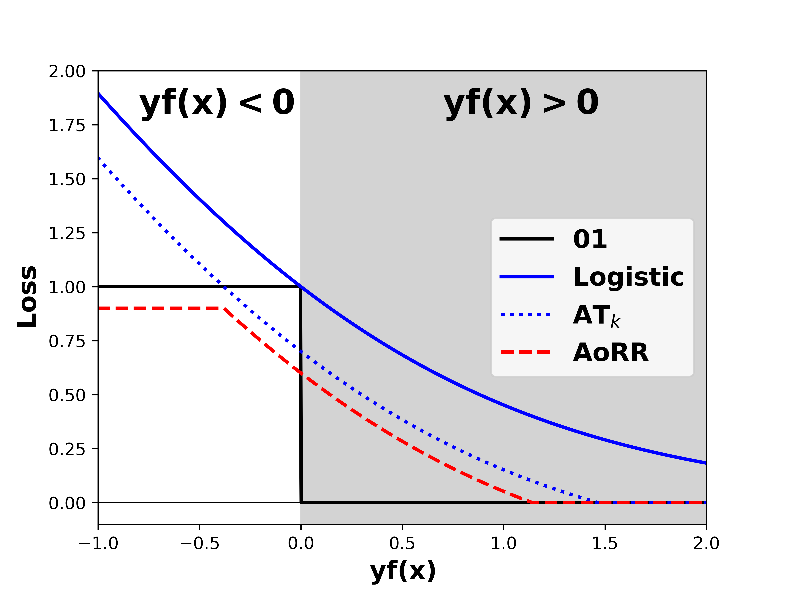

# Learning by Minimizing the Sum of Ranked Range

This repository is the official implementation of our paper "Learning by Minimizing the Sum of Ranked Range". 


## Requirements

To install requirements:

```setup
pip install -r requirements.txt
```

## How to run the AoRR aggregate loss code

#### Experiments on synthetic datasets


To run the AoRR algorithm on synthetic data with individual hinge loss:

```train
python AoRR/run_hinge_synthetic.py
```

To run the AoRR algorithm on synthetic data with individual logistic loss:

```train
python AoRR/run_logistic_synthetic.py
```

#### Experiments on real-world datasets
##### Here, we only provide two examples for running AoRR loss on Monk dataset.

To run the AoRR algorithm on real-world data with individual hinge loss:

```train
python AoRR/run_hinge_real.py
```

To run the AoRR algorithm on real-world data with individual logistic loss:

```train
python AoRR/run_logistic_real.py
```

After these experiments, you can get the results of Table 1.

## How to run TKML algorithm in multi-label scenario

To run the top-k multi-label (TKML) algorithm on the Emotions dataset:

```train
python TKML/TKML_emotions.py
```

After these experiments, you can get the results of Table 2.

## How to run TKML algorithm for robustness analysis

First, you need to generate the Mnist datasets with 20%, 30%, 40% noise.

```train
python TKML_multiclass/generate_datasets_with_noise.py
```
 
Second, you can run the TKML algorithm on the Mnist dataset with different noise levels:

```train
python TKML_multiclass/run_TKML_multiclass.py
```

After these experiments, you can get the results of Table 3.

## How to plot Figure 2 in our paper

```train
python AoRR/plot_aggregate_interpretation.py
```

<p align="center">
    
</p>

## How to plot Figure 3 in our paper

```train
python AoRR/plot_synthetic_result.py
```

## How to plot Figure 4 in our paper

```train
python AoRR/plot_real_data_misclassification.py
```
